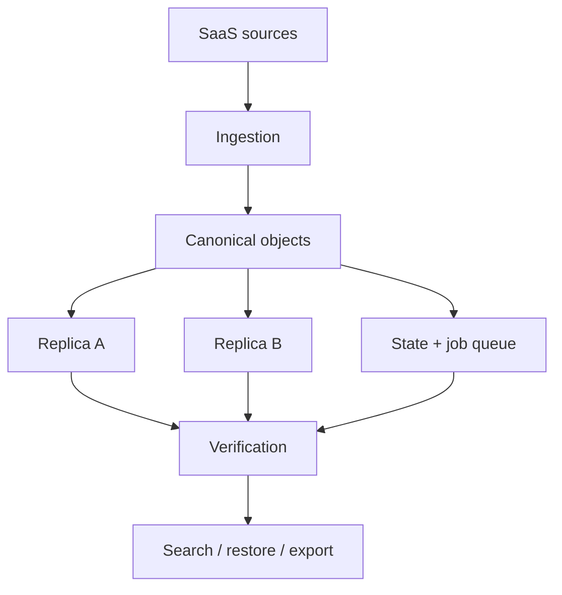
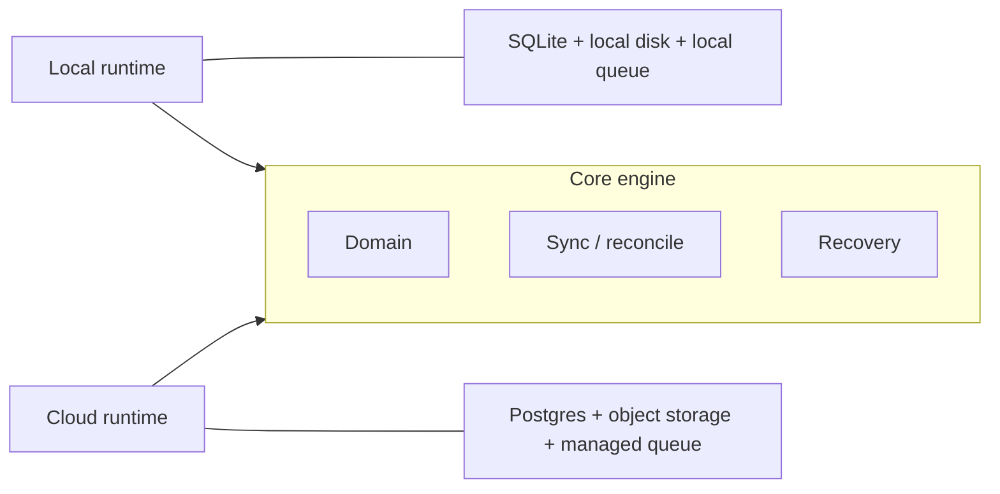

# Burrow

**Your SaaS data. Your storage. Your copy.**

Burrow is an open-source, local-first data ownership and recovery layer for SaaS. It continuously copies the data you care about into storage you control, checks that the copy can actually be restored, and gives you one place to search, recover, and take it with you.

A backup job that finished is not the same thing as data you can get back. Burrow is built around that difference.

> A safe place for your data — without making Burrow the next place you are locked in.

<!-- TODO: add CI badge when the workflow exists -->

---

## Why Burrow?

Businesses run on SaaS: Gmail, Drive, Microsoft 365, Slack, GitHub, Notion. Those products are excellent systems of record. They are not the same as an independent copy you own.

Provider recovery is bounded by *their* windows, *their* formats, and *their* account remaining available. DIY scripts leave you with credentials, checkpoints, retries, and a restore you have never rehearsed.

Burrow sits in between:

- **Ownership** — the copy lives in storage you choose (disk, NAS, S3-compatible, R2).
- **Recoverability** — sync is not “healthy” until restore has been proven.
- **Portability** — you can leave with a real archive, not a Docker volume and a prayer.
- **Choice of runtime** — run it on your machine, or let a managed cloud run the same engine. Convenience is optional. Ownership is not.

Burrow is not a storage company, not an automation canvas, and not “Dropbox for email.” It protects **your independent copy** of SaaS data.

Priorities, in order:

```text
Ownership → Portability → Recoverability → Reliability → Convenience
```

---

## What it does

```text
Source → ingest → canonical objects → state + jobs → replica(s) → verify → search / restore / export
```

| Piece | Role |
| --- | --- |
| **Source** | Knows how to read a provider (Gmail first) without pretending every SaaS looks the same. |
| **Object** | Stable logical record inside Burrow — identity, metadata, content refs, integrity, lineage. |
| **Storage** | Replaceable backend. Local filesystem and S3-compatible APIs first. |
| **Runtime** | Where the engine runs: your machine, or managed infrastructure. Same logic either way. |
| **Consumption** | Search, inspect, restore, export, health — proof that the copy is usable. |

Content is hashed for integrity and deduplication. Logical object IDs stay separate from “this blob’s checksum” and from “Gmail’s message id.” That split is what lets you change storage without renaming the archive.

---

## How it works



Ingestion is **at-least-once**. Writes are **idempotent**. A job can run twice without corrupting the archive. Checkpoints, reconciliation, retries with backoff, and rate limits are part of the engine, not an afterthought.

Push notifications (where a provider offers them) are **triggers, not truth**. Periodic reconciliation still has to close the gaps.

A replica that has never been restored is treated as an assumption, not a green checkmark.

---

## Architecture

Burrow is a **modular monolith** in a **monorepo**, with more than one way to *start* the same engine:

- a local agent/daemon
- an HTTP API
- a web UI
- a cloud worker
- a CLI for ops and debugging

It is not a microservices platform. Module boundaries exist so Gmail does not import S3, recovery does not import a Google client, and the UI does not become the source of truth. Those packages can move later. They do not need a network hop today.



Local and cloud should share business logic. What changes is **placement**: SQLite and a filesystem on a laptop; Postgres and a queue when someone is paying for always-on. The logical archive does not change because the process moved.

The current implementation direction is TypeScript (Bun for local dev and the first local runtime), a React UI, SQLite at home, Postgres in hosted deployments, and S3-compatible object storage. Those are **engineering choices**, not the product. Storage and runtime are supposed to stay replaceable.

---

## Current status

The project is **early**. The product thesis and architecture are in place; the first recovery loop is not shipped yet. Treat everything below as intent unless a section says otherwise.

### Now

- Product definition, architecture, and this repository
- No supported production release yet

### In development

- Canonical object model and storage/source contracts
- Local runtime (SQLite, filesystem, job queue)
- Gmail + attachments: incremental sync, checkpoint, reconcile, restore
- Search against the local catalog
- Portable archive import/export
- Web UI for health, inspect, search, and restore

### Planned

- Second replica (S3-compatible / R2)
- Google Drive, Microsoft 365, Slack, GitHub, Notion, and other sources — **not available today**
- Customer-controlled encryption keys
- Hosted Burrow Cloud and enterprise controls (see [License](#license))

Do not assume a connector exists because it appears on a roadmap list.

---

## Example workflow

The loop we are building toward (not a screenshot of a finished app):

1. Install the local runtime (or run the container).
2. Connect Google Workspace / Gmail with least-privilege access.
3. Choose storage you control — a folder, or a bucket you already own.
4. Let Burrow ingest and verify.
5. Search and preview from the archive, not only from Gmail.
6. Delete a message in Gmail on purpose. Restore it from Burrow. Confirm it matches.

If step 6 has never succeeded, the dashboard should not pretend you are protected.

---

## Storage

Burrow talks to storage through an interface. The first backends are the **local filesystem** and **S3-compatible** APIs (including R2). NAS and other adapters can follow the same contract.

The point is not to pick a clever bucket. The point is that **your storage stays yours and can be swapped**. Burrow should not become a proprietary silo that happens to have ingested Gmail.

Customer content and control-plane metadata stay conceptually separate. Docker is a way to run the process. It is not the archive.

---

## Recovery and portability

Restore is a product surface, not a footnote. Targets we care about:

- back into the original account
- into another account
- download / files on disk
- a full **portable archive**

An export is meant to reconstruct logical application state on another Burrow runtime — another machine, another operator, no original volume required. Roughly:

```text
manifest, schema version, database snapshot,
objects, indexes, config metadata, encryption metadata, checksums
```

Secrets are not dumped as plaintext. Re-authenticate or unwrap with keys you control.

> Export means leaving with your data, not copying a disk image of Burrow.

---

## Reliability

The engine is built around incremental sync, durable checkpoints, pagination, duplicate detection, checksums, verification, credential expiry, interrupted runs, and snapshots of Burrow’s *own* state.

We prefer boring, testable guarantees over pretending the network is exactly-once.

---

## Security principles

No theater, no “enterprise-grade” sticker.

- OAuth tokens encrypted at rest; envelope encryption as the direction of travel
- Customer-held keys as a later capability, not a claim for v0
- Least-privilege scopes on providers
- Restore and export should be auditable
- Customer content is not a telemetry source
- No plaintext secret export

If a control is not implemented yet, it is not listed as a feature.

---

## Getting started

Commands below are the **intended** developer flow. The app is not wired up in this tree yet — treat them as the target, not a verified quickstart.

```bash
git clone https://github.com/<org>/burrow.git   # TODO: canonical remote
cd burrow
bun install                                     # TODO: confirm workspace install
bun dev                                         # TODO: confirm dev script
```

Self-hosting / Docker packaging will land with the local runtime. There is nothing production-ready to `docker compose up` today.

<!-- TODO: link to docs once they exist -->

---

## Development

Work happens in the monorepo. The current toolchain direction is Bun for install, scripts, and the first local process; Vite for the web app.

```bash
bun test          # TODO: package scripts
bun run lint      # TODO: package scripts
```

Please keep provider-specific code inside connectors, storage-specific code inside storage adapters, and recovery independent of both.

See [Contributing](#contributing).

---

## Repository structure

This is the **module map we are implementing**, not a promise that every folder already exists. Boundaries will move; the idea will not: one engine, several entrypoints, no distributed spaghetti.

```text
burrow/
  apps/
    web/              # Web UI
    api/              # HTTP API / control plane
    agent/            # Local runtime / daemon
    worker/           # Cloud / background worker
    cli/              # Ops and debug CLI

  packages/
    domain/           # Canonical objects, IDs, invariants
    core/             # Sync, reconciliation, idempotency
    connectors/       # SaaS sources
    storage/          # Storage port + adapters
    state/            # Durable state
    queue/            # Job queue
    archive/          # Import/export format
    recovery/         # Restore + verification
    search/           # Search port
    crypto/           # Encryption / keys
    observability/    # Logs, metrics, traces
    contracts/        # API and domain contracts
    ui/               # Shared UI
```

`apps/*` are how you *run* Burrow. `packages/*` are how you *change* Burrow without turning every feature into a service.

---

## Roadmap (short)

1. Prove **one** loop: Gmail → local catalog + disk → search → restore.
2. Add an S3-compatible replica and independent verify.
3. Portable archive round-trip.
4. More sources, without weakening the object model.
5. Optional hosted runtime — same engine, different placement.

---

## Contributing

The useful contributions right now are the recovery loop, connector correctness, storage adapters, and tests that fail when restore would fail.

<!-- TODO: CONTRIBUTING.md -->
<!-- TODO: Code of Conduct -->

Open an issue before large design changes. Matching existing module boundaries matters more than adding a new framework.

---

## License

Burrow’s **core** is licensed under the [GNU Affero General Public License v3.0](https://www.gnu.org/licenses/agpl-3.0.html) (AGPLv3).

<!-- TODO: add LICENSE file to the repository -->

AGPLv3 is a copyleft license. It does not mean “non-commercial” and it does not forbid forks. It means that if you run a modified Burrow as a network service, you owe the source to the people who use it.

**Everything required to own, back up, verify, restore, search, and export your data belongs in the open core** — engine, connectors, storage adapters, local runtime, checksums, dedupe, encryption of credentials, verification, search, restore, import/export.

### Open core

A commercial layer may exist for **operating Burrow at organizational scale**, for example:

- SSO / SAML, SCIM, advanced RBAC
- compliance-oriented audit, retention, legal hold
- centralized admin, MSP / multi-tenant operations
- managed Burrow Cloud, support, SLAs

Those are **planned commercial capabilities**, not a current product catalog. You should not need a paid edition to keep an independent copy of your mail.

> Everything required to own and recover your data is open.  
> Everything primarily required to operate Burrow at organizational scale can be commercial.

Community / self-hosted core stays AGPLv3. A hosted cloud and an enterprise offering may come later. This repository is the project, not a pricing page.

---

## Trademark

**Burrow**, the logo, mascot, and related marks are brand assets. The AGPL covers the software. It does not grant rights to use the name or artwork in a way that implies you are the Burrow project. Fork the code; don’t impersonate the burrow.

---

## Community

<!-- TODO: discussions, Discord/Matrix, security contact -->

For now, use GitHub issues.

If you are evaluating Burrow: it exists so SaaS is not the only place your records live, so restore is a habit rather than a story, and so the copy can move when you do.
