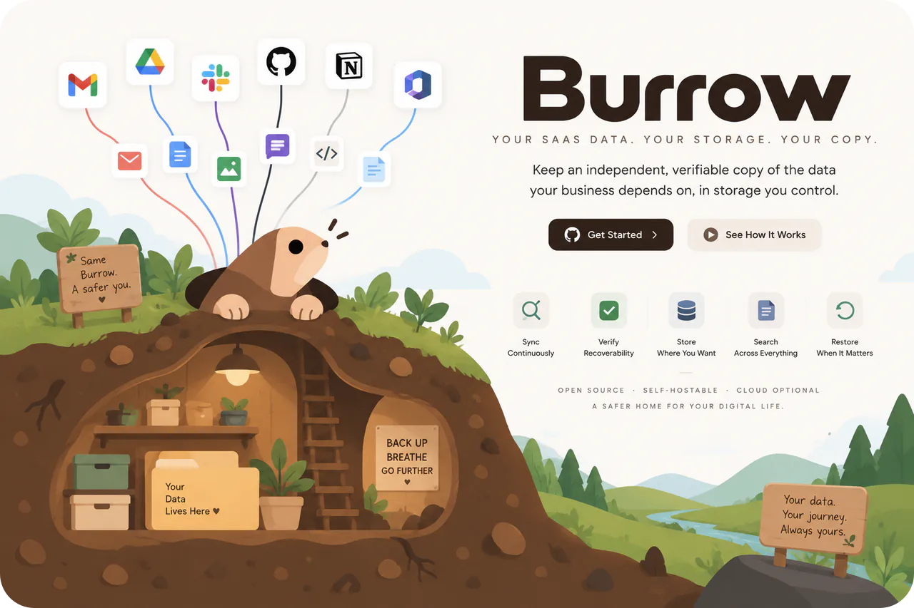
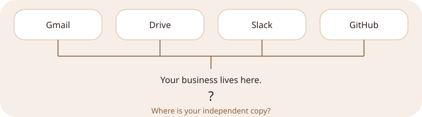
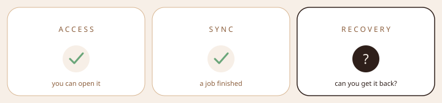
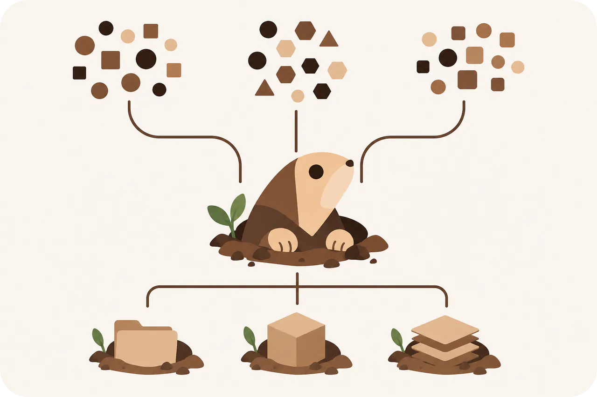
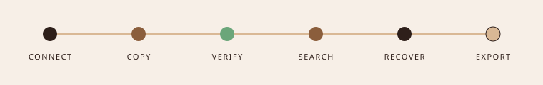
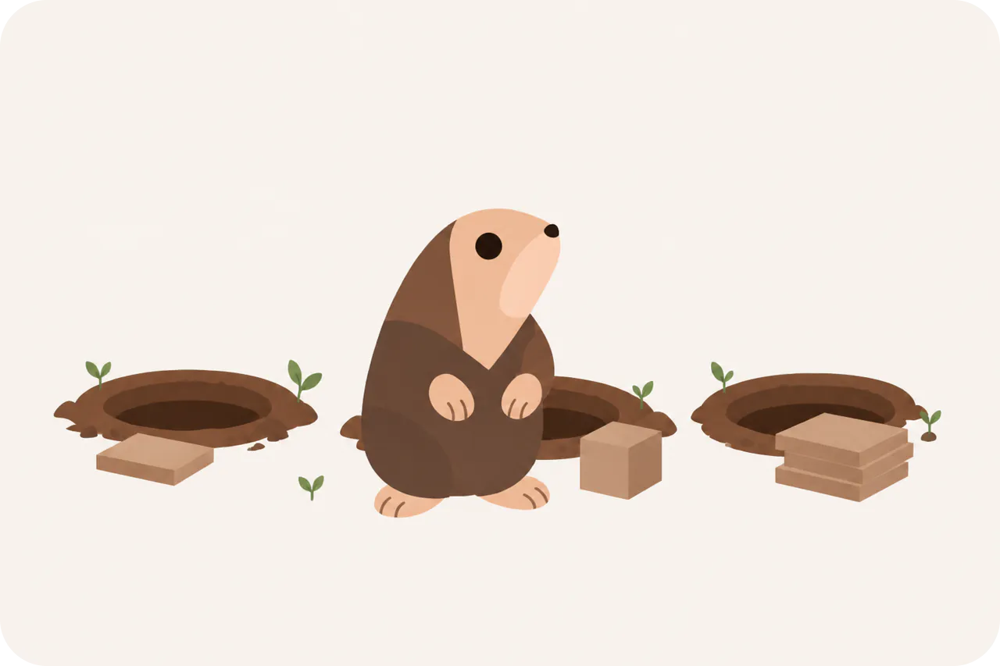
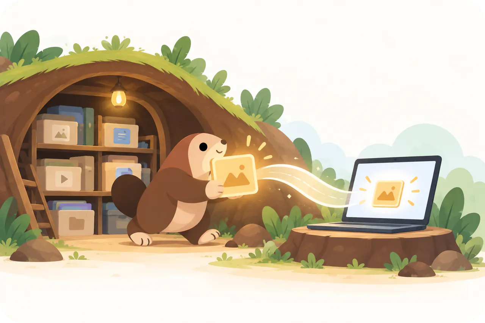
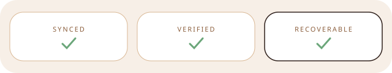
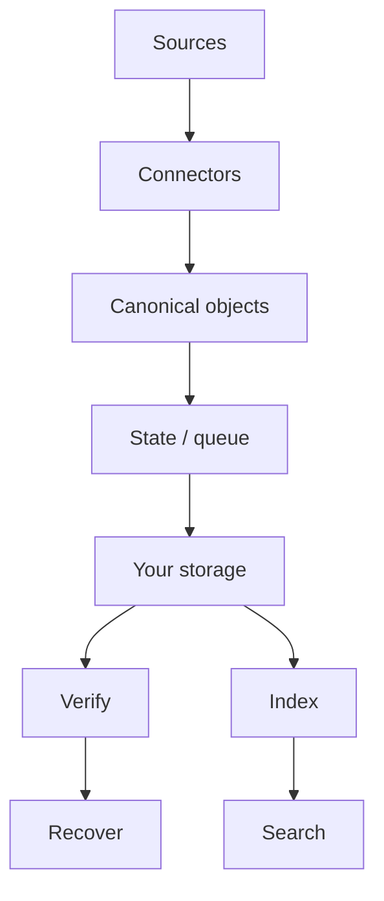
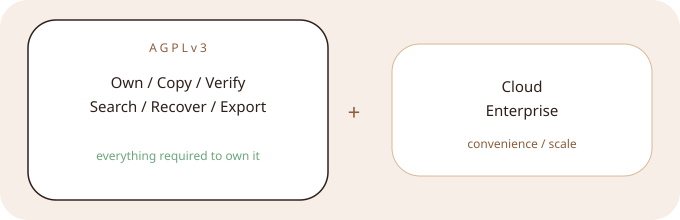

> [!NOTE]
> The first recovery loop is **not shipped**. This README is the product thesis and the build. Nothing here is installable yet.

<p align="center">
  
</p>

<p align="center">
  <a href="#why-this-exists">Why</a>
  &nbsp;·&nbsp;
  <a href="#how-it-works">How</a>
  &nbsp;·&nbsp;
  <a href="#under-the-burrow">Architecture</a>
  &nbsp;·&nbsp;
  <a href="#where-we-are">Status</a>
  &nbsp;·&nbsp;
  <a href="#develop">Develop</a>
</p>

---

## Why this exists

<p align="center">
  
</p>

<p align="center">
  
</p>

<details>
<summary>Access is not a copy</summary>

Being able to open Gmail does not mean you have an independent copy.

</details>

<details>
<summary>Sync is not recovery</summary>

A finished job is not proof you can get the object back.

</details>

<details>
<summary>Recovery is the product</summary>

A backup is not a backup until you have restored from it.

</details>

| If you already have… | Use that |
| --- | --- |
| Files on disk and many storage backends | [rclone](https://rclone.org) |
| Encrypted snapshots of a folder | [restic](https://restic.net) |
| A one-shot Google zip | Takeout |
| A vendor holding the backup | their product |
| **An independent copy of SaaS data, on storage you control, that you can restore** | **Burrow** |

rclone moves files you already possess. restic snapshots a tree you point it at. Burrow is the missing loop: **pull from the SaaS, land on your storage, prove you can get it back.**

If Gmail is how the company runs, Gmail is a single point of failure. Burrow exists so that account is not the only copy.

---

## How it works

<p align="center">
  
</p>

<p align="center"><strong>Burrow gives your data another home.</strong></p>

<p align="center">
  Local-first. Cloud-optional. Quiet in the background.<br/>
  Backup is the mechanism. Ownership and recovery are the point.
</p>

<p align="center">
  
</p>

<details>
<summary>CONNECT</summary>

Link a source. Gmail is the first loop we are building. Other names on this page are roadmap, not connectors.

</details>

<details>
<summary>COPY</summary>

Ingest into a canonical archive, then onto storage you control.

</details>

<details>
<summary>VERIFY</summary>

Checksums, completeness, consistency — not a green job icon. Verify is the operational test.

</details>

<details>
<summary>SEARCH</summary>

Find it in *your* copy, not only in the provider UI.

</details>

<details>
<summary>RECOVER</summary>

Original account, another account, download, or a portable archive.

</details>

<details>
<summary>EXPORT</summary>

Leave with the archive. Secrets stay out of the plaintext dump.

</details>

<p align="center">
  
</p>

```text
Typical path                         Burrow

SaaS → vendor → vendor storage       SaaS → Burrow → YOUR STORAGE
              ↑                                         ↑
         dependency                                independent
```

Bring your own storage. Keep it portable. Leave whenever you want. Burrow should not become the next lock-in.

The first runtime is a **local process** on a machine you already have (laptop, Mini, NAS box). SQLite + disk. Docker, object storage, and a hosted cloud come after the Gmail loop actually restores a message. There is no compose file to copy yet.

<p align="center">
  
</p>

<p align="center">
  
</p>

<p align="center"><strong>A green sync icon isn't enough. Recovery is the point.</strong></p>

---

## Under the burrow

Same engine locally (SQLite + disk) or hosted (Postgres + queue). Placement changes. The archive does not.



Ingestion is at-least-once. Writes are idempotent. Push events are triggers, not truth.

<details>
<summary>Layout and stack</summary>

One local process to start. Modular core. Not microservices.

```text
apps/        agent · web
packages/    contracts · domain · core
             state · storage · connectors
```

`apps/` run Burrow. `packages/` *are* Burrow. Queue, search, archive, and recovery start inside `core` / `state` until they earn a boundary.

TypeScript and Bun for local dev and the first local runtime. SQLite at home, Postgres when hosted, S3-compatible object storage. Choices — not the identity of the product.

</details>

### What we optimize for

Named like [restic](https://github.com/restic/restic) and [Syncthing](https://github.com/syncthing/syncthing): order is the point.

1. **Recoverable** — Restore is the acceptance test. A finished copy job is not. The SLO is a message you have actually gotten back.
2. **Yours** — The copy lives on storage you control. The core does not assume our cloud.
3. **Honest** — Provider OAuth lives on the machine running Burrow. We are not a credential proxy. Export does not dump secrets in plaintext. Customer-held keys and encryption of the archive at rest are planned, not shipped.
4. **Portable** — Leave with the archive. Storage is an abstraction, not a vendor.
5. **Boring-reliable** — Checkpoints, reconcile, retries. At-least-once ingest, idempotent writes. Completeness is a report, not a dashboard we pretend exists.
6. **Local-first** — A laptop or a NAS should be enough. Hosted is the same engine, moved.

---

## Open at the core

<p align="center">
  
</p>

<p align="center"><strong>Everything required to own and recover your data is open.</strong></p>

AGPLv3 for own / copy / verify / recover / export. Cloud and enterprise for convenience and organizational scale — planned, not a catalog.

AGPL is copyleft, not “non-commercial,” and it does not forbid forks. **Burrow**, the logo, and the mascot are trademarks. Fork the code; don’t impersonate the burrow.

The `LICENSE` file is not in the tree yet. Until it is, treat the intent as AGPLv3.

---

## Where we are

| Available | In progress | Planned |
| --- | --- | --- |
| This repo, the thesis, the architecture | Local runtime, Gmail + attachments, verify, search, restore, export, UI | S3 replica, more sources, customer-held keys, hosted cloud |

Drive, Microsoft 365, Slack, GitHub, and Notion are **roadmap names**, not connectors.

Intended first loop (not runnable):

```text
connect gmail → copy → verify → search → restore a message → export
```

---

## Develop

<a id="develop"></a>
<a id="get-your-burrow-running"></a>
<a id="build-with-us"></a>

Nothing production-ready to run. Toolchain is [mise](https://mise.jdx.dev); `make` is the command surface.

```bash
# once: brew install mise
# echo 'eval "$(mise activate zsh)"' >> ~/.zshrc

git clone https://github.com/<org>/burrow.git   # TODO: canonical remote
cd burrow
make install    # mise install + bun install
make doctor
```

`make dev` waits until `apps/agent` and `apps/web` exist.

Useful work: the Gmail loop, storage adapters, tests that fail when restore would fail.

```bash
make test
make lint
```

Open an issue before large design changes. There is no `CONTRIBUTING.md` yet — the Gmail recovery loop is the contribution.

If you find a security issue, do not file a public GitHub issue. There is no `security@` yet; open a private advisory on the repo when the remote exists, or wait until a contact is published.

<p align="center">
  
</p>

<p align="center"><strong>Burrow</strong><br/>Your SaaS data. Your copy.</p>
