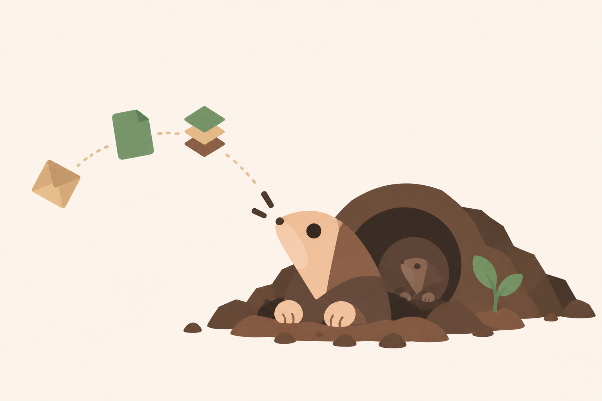
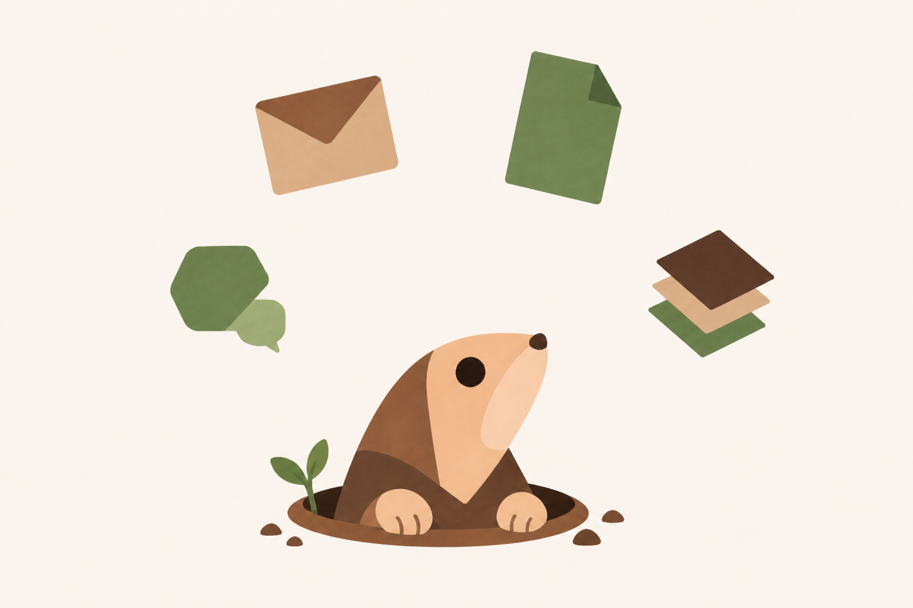
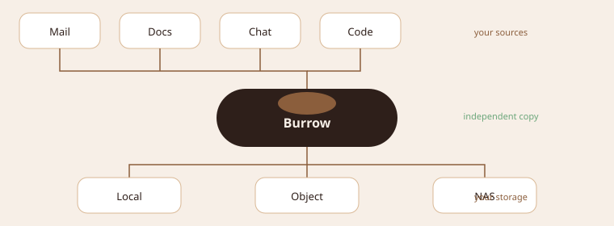
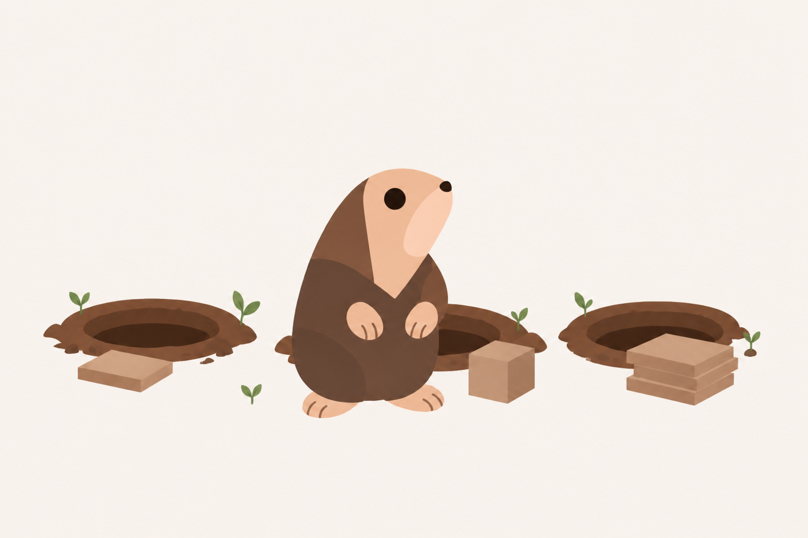
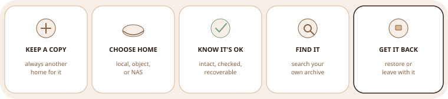
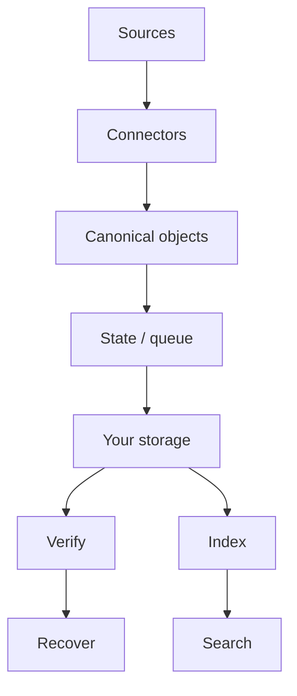

<p align="center">
  
</p>

<h1 align="center">Burrow</h1>

<p align="center">
  <strong>Your SaaS data.<br/>Your storage.<br/>Your copy.</strong>
</p>

<p align="center">
  Keep an independent, verifiable copy<br/>
  of the data your business depends on.
</p>

<p align="center">
  <a href="#get-your-burrow-running"><strong>Get started</strong></a>
  &nbsp;·&nbsp;
  <a href="#under-the-burrow">Architecture</a>
  &nbsp;·&nbsp;
  <a href="#build-with-us">Contribute</a>
</p>

<p align="center">Open source · Self-hostable · Cloud-optional</p>

<p align="center">
  
</p>

---

<p align="center">
  
</p>

<p align="center">
  
</p>

<p align="center"><strong>Your business runs on SaaS. Your independent copy shouldn't have to.</strong></p>

---

<p align="center">
  
</p>

<details>
<summary>Access is not a copy</summary>

Being able to open Gmail does not mean you have an independent copy.

</details>

<details>
<summary>Sync is not recovery</summary>

A completed job does not prove you can get the object back.

</details>

<details>
<summary>Recovery is the product</summary>

A backup isn't a backup until you know you can recover from it.

</details>

---

## Meet Burrow

<p align="center">
  
</p>

<p align="center"><strong>Burrow gives your data another home.</strong></p>

<p align="center">
  Local-first. Cloud-optional. Quietly in the background.<br/>
  Backup is the mechanism. Ownership and recovery are the point.
</p>

---

## Copy. Verify. Recover.

<p align="center">
  
</p>

<details>
<summary>CONNECT</summary>

Link a source. Gmail is the first one we are building.

</details>

<details>
<summary>COPY</summary>

Ingest into a canonical archive, then onto storage you control.

</details>

<details>
<summary>VERIFY</summary>

Checksums, completeness, consistency — not a green job icon.

</details>

<details>
<summary>SEARCH</summary>

Find it in *your* copy, not only in the provider UI.

</details>

<details>
<summary>RECOVER</summary>

Original account, another account, download, or a portable archive.

</details>

<details>
<summary>EXPORT</summary>

Leave with the archive. Secrets stay out of the plaintext dump.

</details>

---

## Your storage. Your choice.

<p align="center">
  
</p>

<p align="center"><strong>Bring your own storage. Keep it portable. Leave whenever you want.</strong></p>

<p align="center">Burrow shouldn't become another lock-in.</p>

```text
Typical path                         Burrow

SaaS → vendor → vendor storage       SaaS → Burrow → YOUR STORAGE
              ↑                                         ↑
         dependency                                independent
```

---

<p align="center">
  
</p>

---

## A green sync icon isn't enough

<p align="center">
  
</p>

<p align="center">
  
</p>

<p align="center"><strong>Recovery is the point.</strong></p>

<p align="center">
  Intact objects. Matching checksums. A restore you have actually done.
</p>

---

## Under the burrow



Same engine locally (SQLite + disk) or hosted (Postgres + queue). Placement changes. The archive does not.

Ingestion is at-least-once. Writes are idempotent. Push events are triggers, not truth.

<details>
<summary>Want to see what's underneath?</summary>

Monorepo. Modular core. Several entry points — not microservices.

```text
apps/        web · api · agent · worker · cli
packages/    domain · core · connectors · storage · state · queue
             archive · recovery · search · crypto · observability
             contracts · ui
```

`apps/` run Burrow. `packages/` *are* Burrow.

Current implementation direction: TypeScript, Bun for local dev and the first local runtime, SQLite at home, Postgres when hosted, S3-compatible object storage. Choices — not the identity of the product.

</details>

### Why it's built this way

| | |
| --- | --- |
| **Local-first** | The core does not assume the copy lives in our cloud. |
| **Storage-agnostic** | Storage is an abstraction, not a vendor. |
| **Runtime-independent** | Same engine locally or hosted. |
| **Recoverability** | Restore is the acceptance test. |
| **Reliability** | Checkpoints, reconcile, retries. Boring on purpose. |

---

## Who it's for

| Founder | Engineer | Self-hoster |
| --- | --- | --- |
| Don't let one SaaS account become a single point of failure. | A recovery engine around idempotency, verification, and portability. | Put the data where you want it. |

| Security | Ops | Contributor |
| --- | --- | --- |
| Credentials, storage, and keys under your control. | Know what's protected before you need it. | Infrastructure for data independence. |

---

## Open at the core

<p align="center">
  
</p>

<p align="center"><strong>Everything required to own and recover your data is open.</strong></p>

<p align="center">
  AGPLv3 for own / copy / verify / recover / export.<br/>
  Cloud and enterprise for convenience and organizational scale — planned, not a catalog.
</p>

AGPL is copyleft, not “non-commercial,” and it does not forbid forks. **Burrow**, the logo, and the mascot are trademarks. Fork the code; don’t impersonate the burrow.

---

## Where we are

The idea is sharp. The first recovery loop is **not shipped**.

| Available | In progress | Planned |
| --- | --- | --- |
| This repo, the thesis, the architecture | Local runtime, Gmail + attachments, verify, search, restore, export, UI | S3 replica, more sources, customer-held keys, hosted cloud |

Drive, Microsoft 365, Slack, GitHub, Notion are **roadmap names**, not connectors.

---

## Get your burrow running

<a id="get-your-burrow-running"></a>

Nothing production-ready to run yet. Toolchain is [mise](https://mise.jdx.dev); `make` is the command surface.

```bash
# once: brew install mise
# echo 'eval "$(mise activate zsh)"' >> ~/.zshrc

git clone https://github.com/<org>/burrow.git   # TODO: canonical remote
cd burrow
make install    # mise install + bun install
make doctor
```

`make dev` waits until `apps/agent` and `apps/web` exist.

---

## Build with us

<a id="build-with-us"></a>

Useful work: the Gmail loop, storage adapters, tests that fail when restore would fail.

```bash
make test
make lint
```

Open an issue before large design changes.

<p align="center">
  
</p>

<p align="center"><strong>Burrow</strong><br/>Your SaaS data. Your copy.</p>
